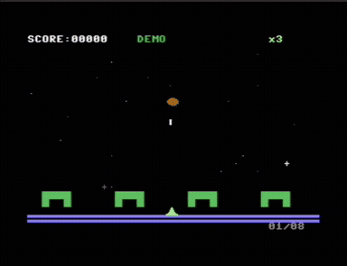
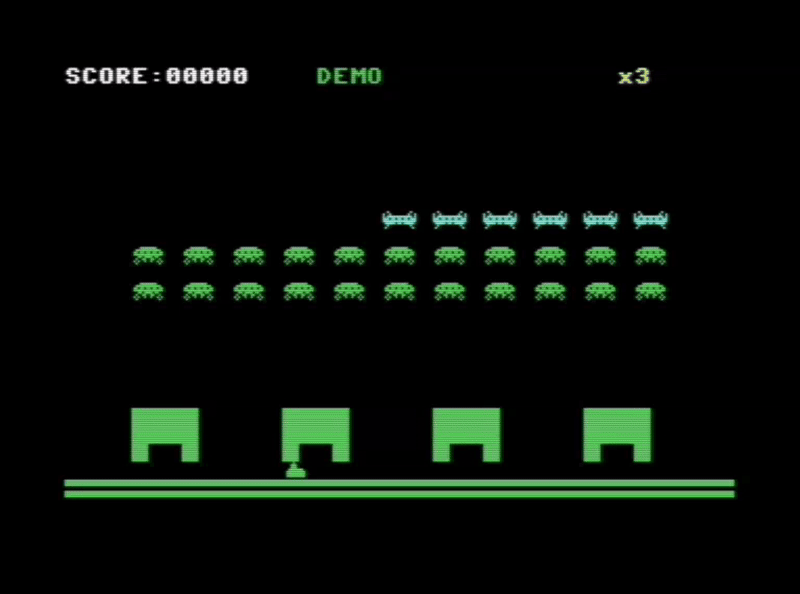
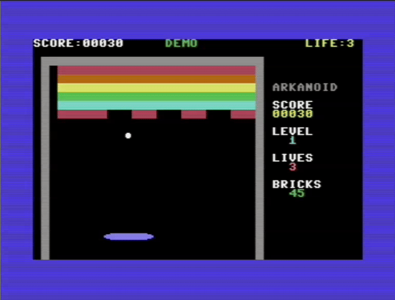
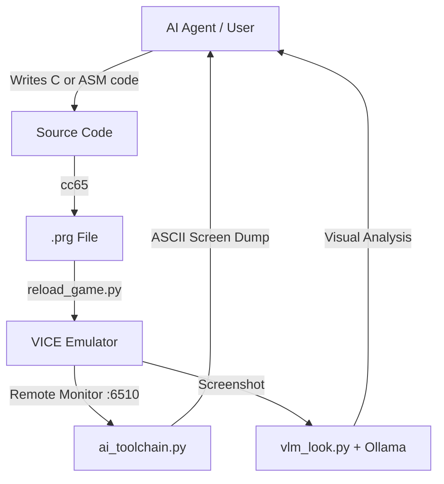

# C64AIToolChain

**C64AIToolChain** is a Commodore 64 development toolchain designed as a **creative benchmark for AI agents**. It uses AI models inside **Visual Studio Code with GitHub Copilot** (agent mode) to develop C and assembly games for the Commodore 64.

**Tested with:** **Google Gemini 3** · **Claude Opus 4.6**

### How It Works as a Benchmark

The agent is given access to the workspace via GitHub Copilot in VS Code and asked to:
1. **Analyze** the project structure, existing games, and development rules (`AGENT_RULES.md`, `AGENT_HOWTO.md`)
2. **Understand** the constraints (6502 CPU, 64KB RAM, VIC-II, SID, cc65 compiler)
3. **Generate a game** — either a classic clone or, for the creative benchmark, an entirely **new original game** by combining mechanics from existing ones

This tests sustained, multi-domain autonomous problem-solving: game design, systems programming, hardware constraints, memory layout, visual debugging, and iterative refinement — all in a single unbroken session. Unlike benchmarks such as ARC-AGI (pattern recognition), SWE-bench (isolated bug fixes), or HumanEval (function-level generation), this measures an agent's ability to **hold a complex constrained system in context and ship a working product**.

> **All `.prg` files are included pre-compiled** — load them directly in VICE without needing cc65.

---

## 🎮 Game Showcase

### ☄️ METEOR STORM — *AI Original (Claude Opus 4.6)*

<p align="center">
  
</p>

An **original game** (not a clone) created entirely by Claude Opus 4.6 via GitHub Copilot. The agent analyzed the existing codebase and designed something new by combining mechanics from Asteroids (splitting meteors), Space Invaders (destructible shields), and Arkanoid (power-up drops).

**1,581 lines of C** · 14 custom characters · 4 hardware sprites · 3-voice SID sound · parallax starfield · combo scoring · UFO bonus · demo AI · progressive wave difficulty.

The agent autonomously found and fixed 7 bugs, including a critical memory layout overlap requiring a custom cc65 linker configuration. Full write-up: [meteor/MEDIUM_ARTICLE.md](meteor/MEDIUM_ARTICLE.md)

---

### 👾 Space Invaders

<p align="center">
  
</p>

A faithful recreation of the arcade classic, written in **C** (`cc65`). 55 custom pixel-art aliens (animated), 4 destructible shields, UFO mystery ship, and full SID sound effects. Visuals verified using Google Gemini 3 VLM.

---

### 🧱 Arkanoid

<p align="center">
  
</p>

A Breakout/Arkanoid clone with 8-bit fixed-point ball physics, sprite-based paddle and ball, multi-hit bricks, and 5 difficulty levels. Uses a constrained 27-column playfield to keep sprite X-coordinates within the single-byte (0–255) range.

---

### 🟡 Pac-Man

<p align="center">
  
</p>

Two versions: **C** (`pacman_c/`, recommended) and **6502 Assembly** (`pacman/`). The C version is fully functional with ghost AI and collision detection. The assembly version demonstrates the challenges of pure asm generation — the compiler acts as a "guard rail" that prevents AI hallucinations on register/memory management.

---

### 🐍 Snake

<p align="center">
  
</p>

The original proof-of-concept game for this toolchain. Written in 6502 Assembly with zero-page optimization, hardware RNG via CIA timers, and an AI demo mode where the game plays itself — verified by the toolchain's visual feedback loop.

---

### Other Games

The repository also includes several additional C64 demos and games:

| Game | Directory | Description |
|------|-----------|-------------|
| **Tetris** | `tetris_v1/`, `tetris_v2/` | Two versions of the classic block puzzle |
| **Pong** | `pong/` | Classic two-paddle game |
| **Breakout** | `breakout/` | Brick-breaking game |
| **Bounce** | `bounce/` | Ball bouncing demo |
| **Plasma** | `plasma/` | Classic plasma effect demo |
| **Starfield** | `starfield/` | Scrolling star parallax effect |
| **Rasterbars** | `rasterbars/` | VIC-II raster bar color effect |
| **Fire** | `fire/` | Fire animation effect |
| **Scroller** | `scroller/` | Text scrolling demo |
| **Matrix** | `matrix/` | Matrix rain effect with custom kanji charset |
| **Christmas** | `christmas/` | Seasonal PETSCII art display |

---

## Architecture



## The Stack

- **AI Models (tested)**:
  - **Google Gemini 3** — classic game clones (Space Invaders, Arkanoid, Pac-Man, Pong, Tetris, etc.)
  - **Claude Opus 4.6** (via GitHub Copilot in VS Code) — original game creation (METEOR STORM), autonomous debugging including memory layout fixes
- **IDE**: Visual Studio Code with GitHub Copilot agent mode
- **Compiler**: `cc65` (6502/6510 cross-compiler, C and assembly)
- **Emulator**: `VICE` (x64sc) running in remote monitor mode
- **VLM**: Ollama with vision models (e.g., `qwen3-vl`) for visual verification of game output
- **Bridge**: Python 3 scripts (`ai_toolchain.py`, `vlm_look.py`) handling socket communication and visual feedback

## Getting Started

### Prerequisites
- **cc65**: Cross-compiler suite.
- **VICE**: Commodore emulator (must support `-remotemonitor`).
- **Python 3**: For the toolchain bridge.

### Installation

```bash
# Clone the repo
git clone https://github.com/yourusername/C64AIToolChain.git
cd C64AIToolChain

# Install dependencies (Linux)
sudo apt install cc65 vice python3
```

### Quick Start — Play a Game

Every game directory includes a pre-compiled `.prg` file. Just launch it:

```bash
cd meteor
./run_vice.sh
```

### The AI Development Workflow

1.  **Launch the Environment**:
    Start VICE with the remote monitor enabled.
    ```bash
    cd snake
    ./run_vice.sh
    ```

2.  **Run the Toolchain**:
    In a separate terminal, start the Python bridge. This visualizes the C64 screen as ASCII, allowing an AI agent to verify the game state.
    ```bash
    python3 ai_toolchain.py
    ```

3.  **Iterate**:
    Modify the source, rebuild, and hot-reload:
    ```bash
    ./build.sh && python3 reload_game.py
    ```

## Toolchain Components

### `run_vice.sh`
Universal VICE launcher that handles environment issues (especially when running from VS Code or other IDEs). It clears problematic environment variables and tries both `x64sc` and `x64` executables.

```bash
# Run with default (snake/snake.prg)
./run_vice.sh

# Run a specific PRG file
./run_vice.sh tetris_v1/tetris.prg
```

### `ai_toolchain.py`
The eyes of the system. It connects to `localhost:6510`, dumps memory range `$0400-$07E7` (Screen RAM), and renders it as ASCII. This allows an AI to verify:
- Did the snake spawn correctly?
- Are the walls drawing?
- Is the score updating?

### `reload_game.py`
The hands of the system. It automates the tedious process of detaching the disk image, loading the new PRG, and restarting the program execution, preserving the emulator window.

### `screenshot.sh`
Capture screenshots from VICE via the remote monitor. Supports multiple formats.

```bash
# Take a PNG screenshot (default)
./screenshot.sh myscreen

# Take a GIF screenshot
./screenshot.sh myscreen 3

# Formats: 0=BMP, 1=PCX, 2=PNG, 3=GIF, 4=IFF
```

## License
MIT
