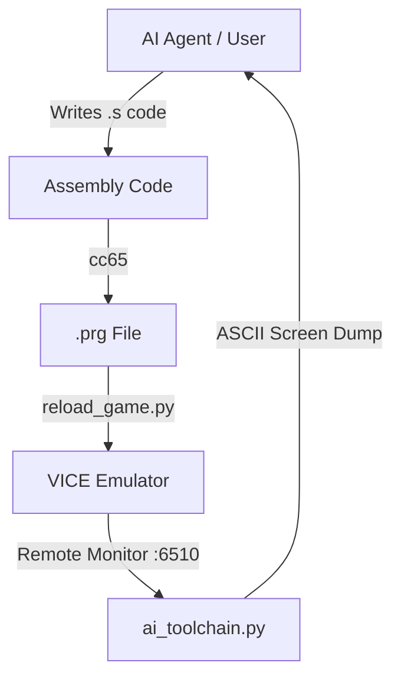
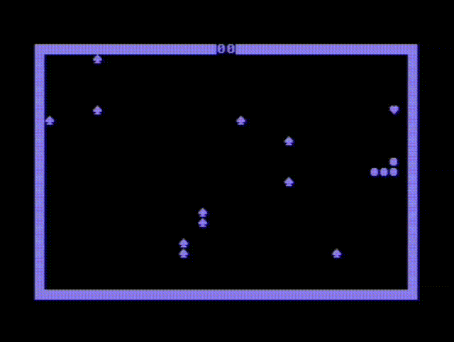
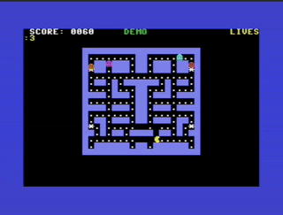

# C64AIToolChain

**C64AIToolChain** is a Commodore 64 toolchain using agents and Google Gemini 3 to develop assembler code for the Commodore 64.

This project demonstrates a workflow where AI models can write, debug, and even playtest 6510 assembly games by providing them with a structured feedback loop involving the VICE emulator and Python-based visual verification.



## Core Concept

Developing in 6510 Assembly is challenging due to the lack of modern debugging tools and the complexity of memory management. **C64AIToolChain** solves this by creating a bridge:

1.  **Code Generation**: You (or the AI) write 6510 Assembly.
2.  **Automated Build**: `cc65` compiles the code instantly.
3.  **Hot Reload**: The binary is injected into a running VICE emulator without a reset.
4.  **Visual Feedback**: A Python script connects to the VICE binary monitor, reads the screen RAM (`$0400`), and converts it into a text-based grid that an AI agent can "see" and analyze.

## The Stack

- **AI Model**: Google Gemini 3 (for logic generation, optimization, and debugging).
- **Compiler**: `cc65` (6502/6510 cross-assembler).
- **Emulator**: `VICE` (x64) running in remote monitor mode.
- **Bridge**: Python 3 scripts (`ai_toolchain.py`) handling the socket communication.

## Included Example: Snake



The repository includes a complete **Snake** game developed using this toolchain. It serves as a proof-of-concept for:
- **Zero Page Optimization**: Efficient use of the 6510's fastest memory.
- **Hardware RNG**: Using the CIA timers for random number generation.
- **AI Demo Mode**: An autonomous mode where the game plays itself, verified by the toolchain.

## Case Study: Pac-Man (C vs Assembly)



This project includes two versions of Pac-Man to demonstrate a critical finding in AI-assisted development:

### 1. The C Version (`pacman_c/`) - **Highly Recommended**
Written in C using the `cc65` compiler.
- **Status**: Fully functional, robust, and easy to modify.
- **Why it works**: The C compiler acts as a deterministic "guard rail." It handles memory allocation, stack management, and variable scope automatically. This reduces the cognitive load on the AI, preventing "hallucinations" where the AI invents non-existent opcodes or mismanages memory addresses.
- **Result**: A stable, playable game with complex logic (ghost AI, collision detection) implemented quickly.

### 2. The Assembly Version (`pacman/`) - **Experimental**
Written in raw 6502 Assembly.
- **Status**: Functional but prone to subtle bugs (e.g., ghost movement logic errors, variable clobbering).
- **The Challenge**: Writing raw Assembly is like predicting a chaotic time series. The AI must mentally track the state of every register (A, X, Y), flags, and memory address at every cycle.
- **Conclusion**: While powerful, pure Assembly increases the risk of "logic drift" or hallucination. Using a high-level language like C with a deterministic compiler (`cc65`) provides a much more reliable foundation for AI code generation, allowing the AI to focus on *logic* rather than *plumbing*.

## Getting Started

### Prerequisites
- **cc65**: Cross-compiler suite.
- **VICE**: Commodore emulator (must support `-remotemonitor`).
- **Python 3**: For the toolchain bridge.

### Installation

```bash
# Clone the repo
git clone https://github.com/yourusername/C64AIToolChain.git
cd C64AIToolChain

# Install dependencies (Linux)
sudo apt install cc65 vice python3
```

### The Workflow

1.  **Launch the Environment**:
    Start VICE with the remote monitor enabled.
    ```bash
    cd snake
    ./run_vice.sh
    ```

2.  **Run the Toolchain**:
    In a separate terminal, start the Python bridge. This will visualize the C64 screen in your terminal, allowing you (or an AI agent) to verify the game state.
    ```bash
    python3 ai_toolchain.py
    ```

3.  **Iterate**:
    Modify `snake/snake.s`. Then, run the reload script to build and inject the new code instantly:
    ```bash
    ./build.sh && python3 reload_game.py
    ```

## Toolchain Components

### `run_vice.sh`
Universal VICE launcher that handles environment issues (especially when running from VS Code or other IDEs). It clears problematic environment variables and tries both `x64sc` and `x64` executables.

```bash
# Run with default (snake/snake.prg)
./run_vice.sh

# Run a specific PRG file
./run_vice.sh tetris_v1/tetris.prg
```

### `ai_toolchain.py`
The eyes of the system. It connects to `localhost:6510`, dumps memory range `$0400-$07E7` (Screen RAM), and renders it as ASCII. This allows an AI to verify:
- Did the snake spawn correctly?
- Are the walls drawing?
- Is the score updating?

### `reload_game.py`
The hands of the system. It automates the tedious process of detaching the disk image, loading the new PRG, and restarting the program execution, preserving the emulator window.

### `screenshot.sh`
Capture screenshots from VICE via the remote monitor. Supports multiple formats.

```bash
# Take a PNG screenshot (default)
./screenshot.sh myscreen

# Take a GIF screenshot
./screenshot.sh myscreen 3

# Formats: 0=BMP, 1=PCX, 2=PNG, 3=GIF, 4=IFF
```

## License
MIT
