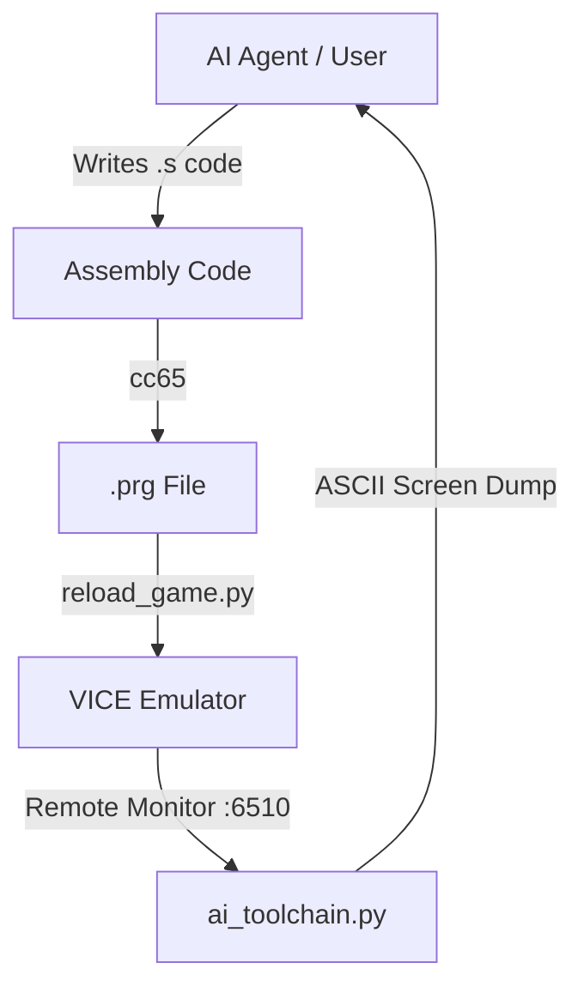

# C64AIToolChain

**C64AIToolChain** is a Commodore 64 development toolchain designed as a **creative benchmark for AI agents**. It uses AI models (tested with **Google Gemini 3** and **Claude Opus 4.6**) inside **Visual Studio Code with GitHub Copilot** to develop C and assembly code for the Commodore 64.

This project demonstrates a workflow where AI models can write, debug, and even playtest 6510 assembly/C games by providing them with a structured feedback loop involving the VICE emulator and Python-based visual verification.

### How It Works as a Benchmark

The agent is given access to the workspace via GitHub Copilot in VS Code and asked to:
1. **Analyze** the project structure, existing games, and development rules
2. **Understand** the constraints (6502 CPU, 64KB RAM, VIC-II, SID, cc65 compiler)
3. **Generate a game** — either a classic clone or, for the creative benchmark, an entirely **new original game** by combining mechanics from existing ones

This tests sustained, multi-domain autonomous problem-solving: game design, systems programming, hardware constraints, memory layout, visual debugging, and iterative refinement — all in a single unbroken session. Unlike benchmarks such as ARC-AGI (pattern recognition), SWE-bench (isolated bug fixes), or HumanEval (function-level generation), this measures an agent's ability to **hold a complex constrained system in context and ship a working product**.



## Core Concept

Developing in 6510 Assembly is challenging due to the lack of modern debugging tools and the complexity of memory management. **C64AIToolChain** solves this by creating a bridge:

1.  **Code Generation**: You (or the AI) write 6510 Assembly.
2.  **Automated Build**: `cc65` compiles the code instantly.
3.  **Hot Reload**: The binary is injected into a running VICE emulator without a reset.
4.  **Visual Feedback**: A Python script connects to the VICE binary monitor, reads the screen RAM (`$0400`), and converts it into a text-based grid that an AI agent can "see" and analyze.

## The Stack

- **AI Models (tested)**:
  - **Google Gemini 3** — classic game clones (Space Invaders, Arkanoid, Pac-Man, Pong, Tetris, etc.)
  - **Claude Opus 4.6** (via GitHub Copilot in VS Code) — original game creation (METEOR STORM), autonomous debugging including memory layout fixes
- **IDE**: Visual Studio Code with GitHub Copilot agent mode
- **Compiler**: `cc65` (6502/6510 cross-compiler, C and assembly).
- **Emulator**: `VICE` (x64sc) running in remote monitor mode.
- **VLM**: Ollama with vision models (e.g., `qwen3-vl`) for visual verification of game output.
- **Bridge**: Python 3 scripts (`ai_toolchain.py`, `vlm_look.py`) handling socket communication and visual feedback.

## Included Example: Snake


The repository includes a complete **Snake** game developed using this toolchain. It serves as a proof-of-concept for:
- **Zero Page Optimization**: Efficient use of the 6510's fastest memory.
- **Hardware RNG**: Using the CIA timers for random number generation.
- **AI Demo Mode**: An autonomous mode where the game plays itself, verified by the toolchain.

## Case Study: Pac-Man (C vs Assembly)


This project includes two versions of Pac-Man to demonstrate a critical finding in AI-assisted development:

### 1. The C Version (`pacman_c/`) - **Highly Recommended**
Written in C using the `cc65` compiler.
- **Status**: Fully functional, robust, and easy to modify.
- **Why it works**: The C compiler acts as a deterministic "guard rail." It handles memory allocation, stack management, and variable scope automatically. This reduces the cognitive load on the AI, preventing "hallucinations" where the AI invents non-existent opcodes or mismanages memory addresses.
- **Result**: A stable, playable game with complex logic (ghost AI, collision detection) implemented quickly.

### 2. The Assembly Version (`pacman/`) - **Experimental**
Written in raw 6502 Assembly.
- **Status**: Functional but prone to subtle bugs (e.g., ghost movement logic errors, variable clobbering).
- **The Challenge**: Writing raw Assembly is like predicting a chaotic time series. The AI must mentally track the state of every register (A, X, Y), flags, and memory address at every cycle.
- **Conclusion**: While powerful, pure Assembly increases the risk of "logic drift" or hallucination. Using a high-level language like C with a deterministic compiler (`cc65`) provides a much more reliable foundation for AI code generation, allowing the AI to focus on *logic* rather than *plumbing*.

## New Addition: Space Invaders


A faithful recreation of the arcade classic, written in **C** (`cc65`).
- **Features**: 55 custom pixel-art aliens (animated), 4 destructible shields, UFO mystery ship, and full sound effects.
- **AI Verified**: The game's visuals (alien formations, HUD, sprites) were verified using **Google Gemini 3 VLM**, ensuring the rendering loop and sprite multiplexing work correctly.
- **Tech Stack**: C for logic + pure VRAM charset manipulation for fluid animations.

## New Addition: Arkanoid


A Breakout/Arkanoid clone demonstrating advanced physics in C.
- **Features**: 8-bit fixed-point physics for ball movement, sprite-based paddle and ball, multi-hit bricks, and 5 difficulty levels.
- **Optimization**: Uses a constrained 27-column playfield to keep sprite X-coordinates within the single-byte (0-255) range for performance efficiency.

## Creative Benchmark: METEOR STORM

*Generated entirely by Claude Opus 4.6 via GitHub Copilot in VS Code — with a single human hint during debugging.*

METEOR STORM is an **original game** (not a clone) created by asking the AI agent to analyze the existing codebase and design something new by combining mechanics from multiple classic games:

| Mechanic | Inspired By |
|----------|-------------|
| Large meteors split into 2 small ones | *Asteroids* |
| 4 destructible shield bunkers | *Space Invaders* |
| Power-ups drop from destroyed meteors | *Arkanoid* |

**Features**: 1,581 lines of C, 14 custom characters, 4 hardware sprites, 3-voice SID sound, parallax starfield, combo scoring, UFO bonus, demo AI, progressive wave difficulty.

**The interesting part**: The agent autonomously found and fixed 7 bugs, including a critical memory layout overlap where the 12KB program was overwriting its own sprite data at `$3000`. The fix required designing a custom cc65 linker configuration with a zero-filled memory gap — a problem that demands understanding of C64 flat binary loading, VIC-II bank selection, and linker segment placement.

Full write-up: [meteor/MEDIUM_ARTICLE.md](meteor/MEDIUM_ARTICLE.md)

## Getting Started

### Prerequisites
- **cc65**: Cross-compiler suite.
- **VICE**: Commodore emulator (must support `-remotemonitor`).
- **Python 3**: For the toolchain bridge.

### Installation

```bash
# Clone the repo
git clone https://github.com/yourusername/C64AIToolChain.git
cd C64AIToolChain

# Install dependencies (Linux)
sudo apt install cc65 vice python3
```

### The Workflow

1.  **Launch the Environment**:
    Start VICE with the remote monitor enabled.
    ```bash
    cd snake
    ./run_vice.sh
    ```

2.  **Run the Toolchain**:
    In a separate terminal, start the Python bridge. This will visualize the C64 screen in your terminal, allowing you (or an AI agent) to verify the game state.
    ```bash
    python3 ai_toolchain.py
    ```

3.  **Iterate**:
    Modify `snake/snake.s`. Then, run the reload script to build and inject the new code instantly:
    ```bash
    ./build.sh && python3 reload_game.py
    ```

## Toolchain Components

### `run_vice.sh`
Universal VICE launcher that handles environment issues (especially when running from VS Code or other IDEs). It clears problematic environment variables and tries both `x64sc` and `x64` executables.

```bash
# Run with default (snake/snake.prg)
./run_vice.sh

# Run a specific PRG file
./run_vice.sh tetris_v1/tetris.prg
```

### `ai_toolchain.py`
The eyes of the system. It connects to `localhost:6510`, dumps memory range `$0400-$07E7` (Screen RAM), and renders it as ASCII. This allows an AI to verify:
- Did the snake spawn correctly?
- Are the walls drawing?
- Is the score updating?

### `reload_game.py`
The hands of the system. It automates the tedious process of detaching the disk image, loading the new PRG, and restarting the program execution, preserving the emulator window.

### `screenshot.sh`
Capture screenshots from VICE via the remote monitor. Supports multiple formats.

```bash
# Take a PNG screenshot (default)
./screenshot.sh myscreen

# Take a GIF screenshot
./screenshot.sh myscreen 3

# Formats: 0=BMP, 1=PCX, 2=PNG, 3=GIF, 4=IFF
```

## License
MIT
