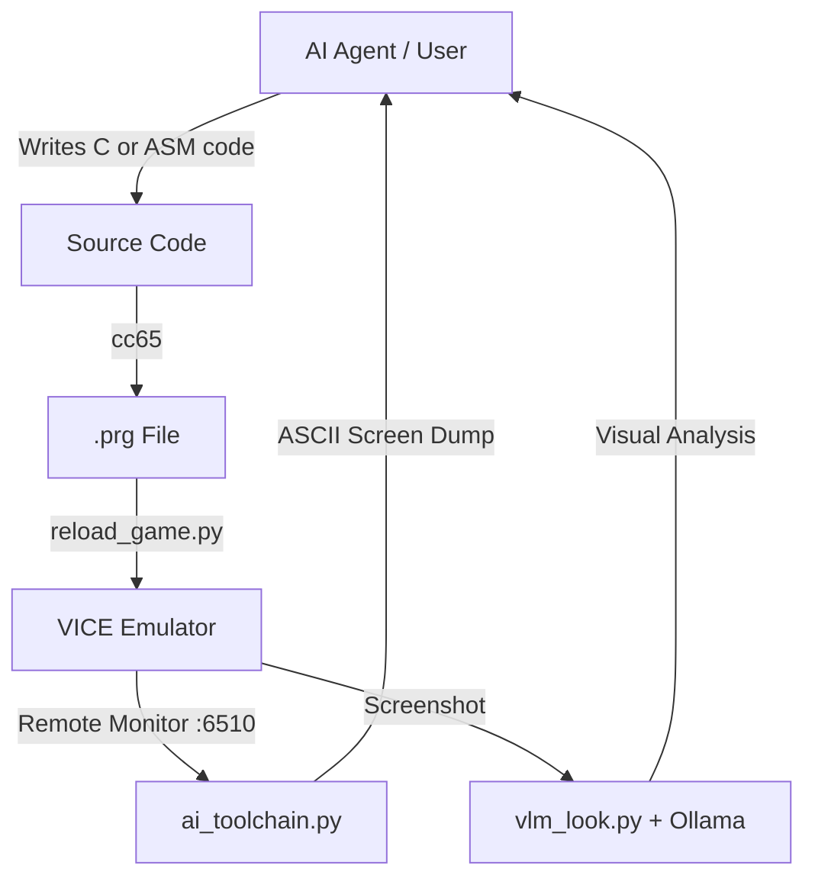

# C64AIToolChain

**C64AIToolChain** is a Commodore 64 development toolchain designed as a **creative benchmark for AI agents**. It uses AI models inside **Visual Studio Code with GitHub Copilot** (agent mode) to develop C and assembly games for the Commodore 64.

**Tested with:** **Google Gemini 3** · **Claude Opus 4.6**

### How It Works as a Benchmark

The agent is given access to the workspace via GitHub Copilot in VS Code and asked to:
1. **Analyze** the project structure, existing games, and development rules (`AGENT_RULES.md`, `AGENT_HOWTO.md`)
2. **Understand** the constraints (6502 CPU, 64KB RAM, VIC-II, SID, cc65 compiler)
3. **Generate a game** — either a classic clone or, for the creative benchmark, an entirely **new original game** by combining mechanics from existing ones

This tests sustained, multi-domain autonomous problem-solving: game design, systems programming, hardware constraints, memory layout, visual debugging, and iterative refinement — all in a single unbroken session. Unlike benchmarks such as ARC-AGI (pattern recognition), SWE-bench (isolated bug fixes), or HumanEval (function-level generation), this measures an agent's ability to **hold a complex constrained system in context and ship a working product**.

> **All `.prg` files are included pre-compiled** — load them directly in VICE without needing cc65.

---

## 🎮 Game Showcase

### ☄️ METEOR STORM — *AI Original (Claude Opus 4.6)*

<p align="center">
  
</p>

An **original game** (not a clone) created entirely by Claude Opus 4.6 via GitHub Copilot. The agent analyzed the existing codebase and designed something new by combining mechanics from Asteroids (splitting meteors), Space Invaders (destructible shields), and Arkanoid (power-up drops).

**1,581 lines of C** · 14 custom characters · 4 hardware sprites · 3-voice SID sound · parallax starfield · combo scoring · UFO bonus · demo AI · progressive wave difficulty.

The agent autonomously found and fixed 7 bugs, including a critical memory layout overlap requiring a custom cc65 linker configuration. Full write-up: [articles/METEOR_STORM.md](articles/METEOR_STORM.md)

---

### 🚀 Dreadline

<p align="center">
  
</p>

An original low-altitude attack game inspired by the feel of Uridium-style dreadnought runs, built as a mixed C and 6502 assembly project. Dreadline combines hardware sprites, generated multicolor sprite art, a bitmap-authored hi-res custom character deck, and an assembly row scroller to keep the background moving smoothly on a stock C64.

The asset pipeline is part of the experiment: `spritegen.py` converts editable ASCII art into C64 multicolor sprites, while `bggen.py` turns `deck_bitmap.pgm` into a deduplicated custom charset plus screen and color maps. Full write-up: [articles/DREADLINE.md](articles/DREADLINE.md)

---

### 💎 Boulder Rush — *Claude Code (Fable)*

<p align="center">
  
</p>

A Boulder Dash tribute with authentic cave physics: boulders and gems fall, roll off rounded objects, and are deadly only while falling. Custom charset, seeded procedural caves, SID sfx — and a new benchmark dimension: `demo_bot.py` plays the game autonomously, reading the cave from screen RAM through the VICE monitor, planning with weighted BFS, and steering through the edge-triggered agent input byte at `$033C`.

---

### 🌌 ION RIFT — *Claude Code (Fable)*

<p align="center">
  
</p>

A horizontally scrolling shoot-em-up built to go one step past Dreadline: pixel-smooth `$D016` scrolling at 50 fps, a two-interrupt raster split (steady HUD above a scrolling playfield), double-buffered screen RAM flipped in the IRQ, procedural multicolor terrain generated column by column, a unified `assetgen.py` tile+sprite pipeline, and a two-voice SID music engine with a dedicated sfx voice. Write-up: [articles/FABLE_BENCHMARK.md](articles/FABLE_BENCHMARK.md)

---

### 👾 Space Invaders

<p align="center">
  
</p>

A faithful recreation of the arcade classic, written in **C** (`cc65`). 55 custom pixel-art aliens (animated), 4 destructible shields, UFO mystery ship, and full SID sound effects. Visuals verified using Google Gemini 3 VLM.

---

### 🧱 Arkanoid

<p align="center">
  
</p>

A Breakout/Arkanoid clone with 8-bit fixed-point ball physics, sprite-based paddle and ball, multi-hit bricks, and 5 difficulty levels. Uses a constrained 27-column playfield to keep sprite X-coordinates within the single-byte (0–255) range.

---

### 🟡 Pac-Man

<p align="center">
  
</p>

Two versions: **C** (`pacman_c/`, recommended) and **6502 Assembly** (`pacman/`). The C version is fully functional with ghost AI and collision detection. The assembly version demonstrates the challenges of pure asm generation — the compiler acts as a "guard rail" that prevents AI hallucinations on register/memory management.

---

### 🐍 Snake

<p align="center">
  
</p>

The original proof-of-concept game for this toolchain. Written in 6502 Assembly with zero-page optimization, hardware RNG via CIA timers, and an AI demo mode where the game plays itself — verified by the toolchain's visual feedback loop.

---

### Other Games

The repository also includes several additional C64 demos and games:

| Game | Directory | Description |
|------|-----------|-------------|
| **Tetris** | `tetris_v1/`, `tetris_v2/` | Two versions of the classic block puzzle |
| **Pong** | `pong/` | Classic two-paddle game |
| **Breakout** | `breakout/` | Brick-breaking game |
| **Bounce** | `bounce/` | Ball bouncing demo |
| **Plasma** | `plasma/` | Classic plasma effect demo |
| **Starfield** | `starfield/` | Scrolling star parallax effect |
| **Rasterbars** | `rasterbars/` | VIC-II raster bar color effect |
| **Fire** | `fire/` | Fire animation effect |
| **Scroller** | `scroller/` | Text scrolling demo |
| **Matrix** | `matrix/` | Matrix rain effect with custom kanji charset |
| **Christmas** | `christmas/` | Seasonal PETSCII art display |

---

## Architecture


```mermaid
graph TD
    AI[AI Agent / User] -->|Writes C or ASM code| Code[Source Code]
    Code -->|cc65| Binary[.prg File]
    Binary -->|reload_game.py| VICE[VICE Emulator]
    VICE -->|Remote Monitor :6510| Bridge[ai_toolchain.py]
    Bridge -->|ASCII Screen Dump| AI
    VICE -->|Screenshot| VLM[vlm_look.py + Ollama]
    VLM -->|Visual Analysis| AI
```

## The Stack

- **AI Models (tested)**:
  - **Google Gemini 3** — classic game clones (Space Invaders, Arkanoid, Pac-Man, Pong, Tetris, etc.)
  - **Claude Opus 4.6** (via GitHub Copilot in VS Code) — original game creation (METEOR STORM), autonomous debugging including memory layout fixes
- **IDE**: Visual Studio Code with GitHub Copilot agent mode
- **Compiler**: `cc65` (6502/6510 cross-compiler, C and assembly)
- **Emulator**: `VICE` (x64sc) running in remote monitor mode
- **VLM**: Ollama with vision models (e.g., `qwen3-vl`) for visual verification of game output
- **Bridge**: Python 3 scripts (`ai_toolchain.py`, `vlm_look.py`) handling socket communication and visual feedback

## Getting Started

### Prerequisites
- **cc65**: Cross-compiler suite.
- **VICE**: Commodore emulator (must support `-remotemonitor`).
- **Python 3**: For the toolchain bridge.

### Installation

```bash
# Clone the repo
git clone https://github.com/dexmac221/C64AIToolChain.git
cd C64AIToolChain

# Install dependencies (Linux)
sudo apt install cc65 vice python3
```

### Quick Start — Play a Game

Every game directory includes a pre-compiled `.prg` file. Just launch it:

```bash
cd meteor
./run_vice.sh
```

### The AI Development Workflow

1.  **Launch the Environment**:
    Start VICE with the remote monitor enabled.
    ```bash
    cd snake
    ./run_vice.sh
    ```

2.  **Run the Toolchain**:
    In a separate terminal, start the Python bridge. This visualizes the C64 screen as ASCII, allowing an AI agent to verify the game state.
    ```bash
    python3 ai_toolchain.py
    ```

3.  **Iterate**:
    Modify the source, rebuild, and hot-reload:
    ```bash
    ./build.sh && python3 reload_game.py
    ```

## Toolchain Components

### `run_vice.sh`
Universal VICE launcher that handles environment issues (especially when running from VS Code or other IDEs). It clears problematic environment variables and tries both `x64sc` and `x64` executables.

```bash
# Run with default (snake/snake.prg)
./run_vice.sh

# Run a specific PRG file
./run_vice.sh tetris_v1/tetris.prg
```

### `ai_toolchain.py`
The eyes of the system. It connects to `localhost:6510`, dumps memory range `$0400-$07E7` (Screen RAM), and renders it as ASCII. This allows an AI to verify:
- Did the snake spawn correctly?
- Are the walls drawing?
- Is the score updating?

### `async_agent_control.py`
The fast/slow gameplay testing loop. A local System 1 controller samples VICE hardware state at high frequency, watches sprite registers, collisions, sprite pointers, and screen RAM, then accumulates a Surprise/Frustration score. When the score crosses a threshold, it can either stop and write an interrupt JSON for deliberate inspection, or keep the gameplay thread running while archiving interrupt events and dispatching them to System 2 asynchronously.

```bash
# Observe Dreadline once
python3 async_agent_control.py --game dreadline --once

# Run until a slow-loop interrupt is generated
python3 async_agent_control.py --game dreadline --threshold 12

# Let System 1 drive Dreadline through its monitor-written agent input byte
./run_vice.sh dreadline/dreadline.prg
python3 async_agent_control.py --game dreadline --control vice-memory --start-fire-frames 20 --max-frames 300

# Keep the game running and send archived interrupt events to System 2 in the background
python3 async_agent_control.py --game dreadline --system1 neural --neural-model .agent_control/system1_dreadline.pt --control vice-memory --start-fire-frames 20 --interrupt-mode continue --interrupt-cooldown-frames 30 --system2-script system2_ollama.py --system2-model deepseek-v4-flash:cloud --max-frames 300

# Train and use a neural System 1 distilled from synthetic heuristic data
python3 neural_system1.py train --output .agent_control/system1_dreadline.pt
python3 async_agent_control.py --game dreadline --system1 neural --neural-model .agent_control/system1_dreadline.pt --control vice-memory --start-fire-frames 20 --max-frames 300

# Ask an Ollama cloud model to analyze the latest slow-loop interrupt
python3 system2_ollama.py --model deepseek-v4-flash:cloud --escalate-model deepseek-v4-pro:cloud
```

Safety note: `--once` leaves VICE paused by default, and the fast loop clamps overly aggressive sampling intervals unless `--unsafe-fast` is explicitly used.

Full architecture: [ASYNC_AGENT_CONTROL.md](ASYNC_AGENT_CONTROL.md)

### `vlm_look.py`
The "brain" of the visual feedback loop. It takes a screenshot from VICE, sends it to a local Ollama instance (running `qwen3-vl` or similar), and returns a structured analysis of the game state (sprites, text, glitches). This allows the agent to "see" the game screen and verify visual elements that `ai_toolchain.py` (which only sees text RAM) might miss.

### `reload_game.py`
The hands of the system. It automates the tedious process of detaching the disk image, loading the new PRG, and restarting the program execution, preserving the emulator window.

### `img2sprite.py`
Turns any picture into the 12×21 multicolour grid the games' `assetgen.py`
already eats. A sprite is 63 bytes with four states per cell — transparent,
`$D025`, `$D026`, and the sprite's own colour — so the script's whole job is
spending that budget: mask the subject, average it down, and fit every cell to
the nearest of the three inks (brute-forcing the palette when you let it
choose).

```bash
./img2sprite.py knight.png --name ART_STAND --preview /tmp/k.png
./img2sprite.py zombie.png --stretch --ink 5 --outline   # shape only
```

It is exact — round-tripping a hand-drawn sprite through a rendered PNG gives
back all 21 rows unchanged — but exactness is not the same as usefulness. What
survives 12×21 is a bold shape with real tonal structure; realistic figures,
spread wings and heraldry arrive as mush, whatever generated or drew them. See
[img2sprite_examples.png](articles/img2sprite_examples.png).

### `assetsheet.py`
The other direction, and the more useful one. Art authored as ASCII inside a
game's `assetgen.py` is only ever seen 21 pixels tall inside a screenshot —
which is to say, never seen. This draws every sprite and tile magnified, in the
colours the game actually sets, on the game's own background.

```bash
./assetsheet.py ghosts/assetgen.py --out /tmp/sheet.png
./assetsheet.py ghosts/assetgen.py --strip ART_RUN1,ART_RUN2 --scale 14
./assetsheet.py ghosts/assetgen.py --tiles --grid
```

It paid for itself the first time it was run: GHOST KEEP's knight and its
zombies turned out to be [the same silhouette in two
colours](articles/ghostkeep_sprite_redraw.png), which had been mistaken for a
scrolling problem.

### `screenshot.sh`
Capture screenshots from VICE via the remote monitor. Supports multiple formats.

```bash
# Take a PNG screenshot (default)
./screenshot.sh myscreen

# Take a GIF screenshot
./screenshot.sh myscreen 3

# Formats: 0=BMP, 1=PCX, 2=PNG, 3=GIF, 4=IFF
```

## References

*   [The Commodore 64 Constraint: Why Gemini 3 is the First AI to Beat the Tetris Test](https://medium.com/@gianlucabailo/the-commodore-64-constraint-why-gemini-3-is-the-first-ai-to-beat-the-tetris-test-6db84609ae15)
*   [I Made Claude and Gemini Write Tetris for a 1982 Computer](https://medium.com/@gianlucabailo/i-made-claude-and-gemini-write-tetris-for-a-1982-computer-cc5c85936f8d)
*   [Claude 4.6 and the Commodore 64: When an LLM Writes, Builds, and Playtests Its Own Game](https://medium.com/ai-advances/claude-4-6-and-the-commodore-64-when-an-llm-writes-builds-and-playtests-its-own-game-bdeb9dca3c74)
*   [METEOR STORM: Full creative process log](articles/METEOR_STORM.md)

## License
MIT
