# C64AIToolChain

**C64AIToolChain** is a Commodore 64 development toolchain designed as a **creative benchmark for AI agents**. An agent is dropped into this workspace with a cross-compiler, an emulator it can drive through a socket, and a set of rules, and is asked to design, build, play-test and ship games for a 1982 computer — C and 6502 assembly, 64 KB, no debugger but the one it writes itself.

**Tested with:** **Google Gemini 3** · **Claude Sonnet 4.5 / 4.6** · **Claude Opus 4.5 / 4.6** (GitHub Copilot, Cursor) · **OpenAI GPT-5.5 / Codex** · **Claude Fable 5** · **Claude Fable 5.1** (Claude Code)

### How It Works as a Benchmark

The agent is given the workspace and asked to:
1. **Analyze** the project structure, the existing games, and the development rules (`AGENT_RULES.md`, `AGENT_HOWTO.md`)
2. **Understand** the constraints (6502 CPU, 64 KB RAM, VIC-II, SID, the cc65 compiler and what it does to byte arithmetic)
3. **Build a game** — a classic clone, an original that combines mechanics from existing ones, or, at the top of the ladder, a scrolling engine that must prove itself with a profiler before a tile is drawn
4. **Test it** the way a player would — by looking (a local VLM, magnified asset sheets), by reading (screen RAM, counters written to RAM), and by playing (demo bots and autopilots that steer the game through a memory-mapped input byte)

This tests sustained, multi-domain autonomous problem-solving: game design, systems programming, hardware constraints, memory layout, measurement, visual debugging, and iterative refinement — over sessions that last days. Unlike benchmarks such as ARC-AGI (pattern recognition), SWE-bench (isolated bug fixes), or HumanEval (function-level generation), this measures an agent's ability to **hold a complex constrained system in context and ship a working product**, and to say honestly, with numbers, when it has not.

Several generations of models have worked here, and the showcase below runs newest first: **OpenAI Codex** on DEEP SIGNAL; **Fable 5.1** on IRON VEIN and **Fable 5** on ION RIFT, GHOST KEEP and Boulder Rush, both in Claude Code, where the agent also built its own measurement and testing tools; **GPT-5.5** on Dreadline and Sky Miner; the **Opus 4.6** original in Copilot (METEOR STORM), Sonnet and Opus 4.x on the mid-period games; and the **Gemini 3** and **Sonnet 4.5** clones that started it all (Space Invaders, Arkanoid, Pac-Man, Snake, Tetris…).

> **All `.prg` files are included pre-compiled** — load them directly in VICE without needing cc65.

---

## 🎮 Game Showcase

### DEEP SIGNAL — OpenAI Codex

Platform shooter originale C64 PAL, sviluppato da **OpenAI Codex** con direzione
e feedback dell’utente: codice C/Assembly 6502, grafica e mappa originali.
Scrolling nelle otto direzioni, tre ripetitori, quattro droni, checkpoint e demo
che completa la missione. [Gioco e comandi](deep_signal/README.md) ·
[Diario con errori e misure](deep_signal/DEVLOG.md) ·
[Articolo per Medium: difficoltà e sviluppo](articles/DEEP_SIGNAL_MEDIUM_IT.md).

**Demo automatica:** premi F1 dalla schermata iniziale, oppure attendi circa
dieci secondi. La demo salta, spara, collega i ripetitori e raggiunge l’uscita.
Avvio: `./deep_signal/run_vice.sh`.

<p align="center">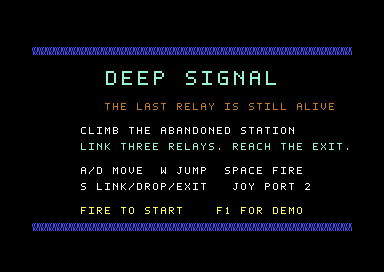</p>

Zero scadenze mancate nel percorso misurato; confronto a parità di condizioni
con IRON VEIN ancora da svolgere. È un primo livello, non una valutazione
comparativa conclusa.

---

### ⛏️ IRON VEIN — *Claude Code (Fable 5.1)*

<p align="center">
  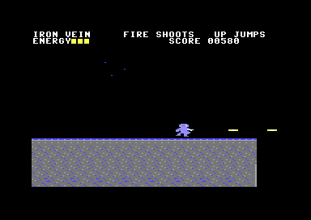
</p>

An 8-way scrolling action demo in the Turrican class, built spike-first: the engine was profiled until it said 50 fps before a tile was drawn. Double-buffered screen RAM with colour per world row (colour RAM cannot be double-buffered, so the art direction follows the engine), a commit-and-stall camera that prepares the shifted buffer over seven frames, a HUD/playfield split verified in all eight fine-scroll phases, a double-banked sprite multiplexer, and every per-object routine in assembly after cc65 measured four times slower. Gravity, a hero with twelve frames, shots, a designed 64×32 level, a four-sprite boss, energy and score, and an object budget found the hard way: eight enemies ran the frame 62% late, six run it clean. The diary with every dead end is [ironvein/DEVLOG.md](ironvein/DEVLOG.md); the article is [articles/IRONVEIN_8WAY.md](articles/IRONVEIN_8WAY.md).

---

### 🏰 GHOST KEEP — *Claude Code (Fable 5)*

<p align="center">
  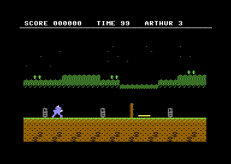
</p>

A Ghosts 'n Goblins tribute on the ION RIFT engine: a smooth-scrolling graveyard with a ragged ridge on the horizon, a knight with the arcade's rigid jump arc and a lance, zombies that rise out of the ground and walk past instead of parking inside the hero, crows, a title screen and an attract-mode demo. Its sprites are where [assetsheet.py](#assetsheetpy) paid for itself. Notes and open items in [ghosts/README.md](ghosts/README.md).

---

### 🌌 ION RIFT — *Claude Code (Fable 5)*

<p align="center">
  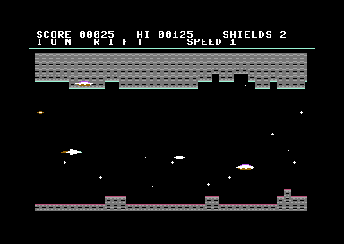
</p>

A horizontally scrolling shoot-em-up built to go one step past Dreadline: pixel-smooth `$D016` scrolling at 50 fps, a two-interrupt raster split (steady HUD above a scrolling playfield), double-buffered screen RAM flipped in the IRQ, procedural multicolor terrain generated column by column, a unified `assetgen.py` tile+sprite pipeline, and a two-voice SID music engine with a dedicated sfx voice. Write-up: [articles/FABLE_BENCHMARK.md](articles/FABLE_BENCHMARK.md)

---

### 💎 Boulder Rush — *Claude Code (Fable 5)*

<p align="center">
  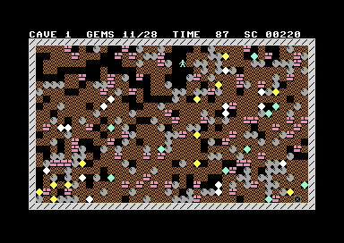
</p>

A Boulder Dash tribute with authentic cave physics: boulders and gems fall, roll off rounded objects, and are deadly only while falling. Custom charset, seeded procedural caves, SID sfx — and a new benchmark dimension: `demo_bot.py` plays the game autonomously, reading the cave from screen RAM through the VICE monitor, planning with weighted BFS, and steering through the edge-triggered agent input byte at `$033C`.

---

### 🚀 Dreadline — *OpenAI GPT-5.5*

<p align="center">
  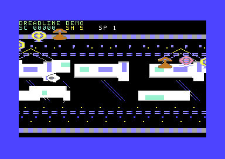
</p>

An original low-altitude attack game inspired by the feel of Uridium-style dreadnought runs, built as a mixed C and 6502 assembly project. Dreadline combines hardware sprites, generated multicolor sprite art, a bitmap-authored hi-res custom character deck, and an assembly row scroller to keep the background moving smoothly on a stock C64.

The asset pipeline is part of the experiment: `spritegen.py` converts editable ASCII art into C64 multicolor sprites, while `bggen.py` turns `deck_bitmap.pgm` into a deduplicated custom charset plus screen and color maps. Dreadline is also the test bed for the [System 1 / System 2 agent control loop](#async_agent_controlpy). Full write-up: [articles/DREADLINE.md](articles/DREADLINE.md)

---

### ☄️ METEOR STORM — *AI Original (Claude Opus 4.6)*

<p align="center">
  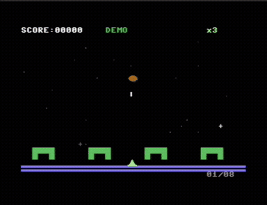
</p>

An **original game** (not a clone) created entirely by Claude Opus 4.6 via GitHub Copilot. The agent analyzed the existing codebase and designed something new by combining mechanics from Asteroids (splitting meteors), Space Invaders (destructible shields), and Arkanoid (power-up drops).

**1,581 lines of C** · 14 custom characters · 4 hardware sprites · 3-voice SID sound · parallax starfield · combo scoring · UFO bonus · demo AI · progressive wave difficulty.

The agent autonomously found and fixed 7 bugs, including a critical memory layout overlap requiring a custom cc65 linker configuration. Full write-up: [articles/METEOR_STORM.md](articles/METEOR_STORM.md)

---

### 👾 Space Invaders — *Gemini 3*

<p align="center">
  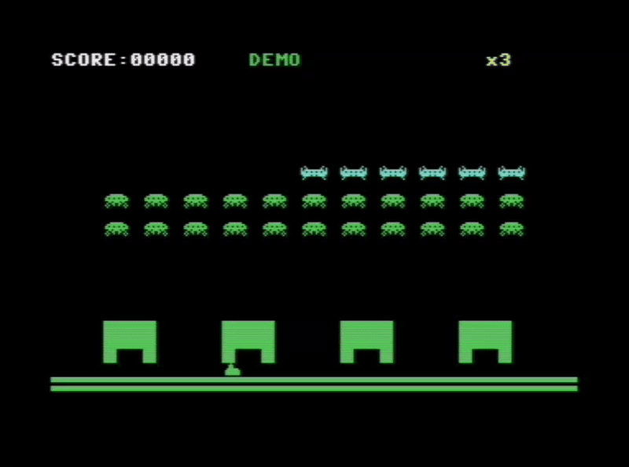
</p>

A faithful recreation of the arcade classic, written in **C** (`cc65`). 55 custom pixel-art aliens (animated), 4 destructible shields, UFO mystery ship, and full SID sound effects. Visuals verified using Google Gemini 3 VLM.

---

### 🧱 Arkanoid — *Gemini 3*

<p align="center">
  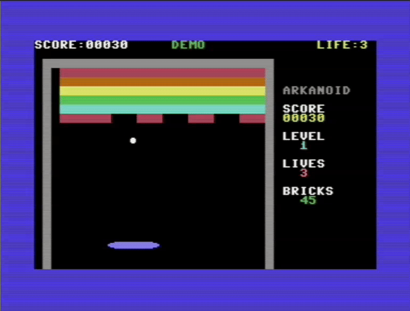
</p>

A Breakout/Arkanoid clone with 8-bit fixed-point ball physics, sprite-based paddle and ball, multi-hit bricks, and 5 difficulty levels. Uses a constrained 27-column playfield to keep sprite X-coordinates within the single-byte (0–255) range.

---

### 🟡 Pac-Man — *Gemini 3*

<p align="center">
  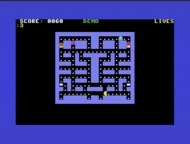
</p>

Two versions: **C** (`pacman_c/`, recommended) and **6502 Assembly** (`pacman/`). The C version is fully functional with ghost AI and collision detection. The assembly version demonstrates the challenges of pure asm generation — the compiler acts as a "guard rail" that prevents AI hallucinations on register/memory management.

---

### 🐍 Snake — *Gemini 3*

<p align="center">
  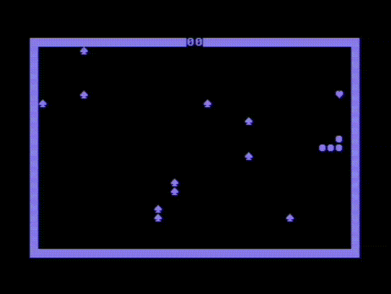
</p>

The original proof-of-concept game for this toolchain. Written in 6502 Assembly with zero-page optimization, hardware RNG via CIA timers, and an AI demo mode where the game plays itself — verified by the toolchain's visual feedback loop.

---

### Other Games and Demos

| Game | Directory | Description |
|------|-----------|-------------|
| **Sky Miner** | `sky_miner/` | Original: catch crystals, dodge meteors, sprite-based, demo mode (GPT-5.5) |
| **Frogger** | `frogger/` | The arcade classic in multicolour bitmap mode, cc65 (Claude Sonnet 4.6 in Cursor) |
| **Snake 2** | `snake2/` | Snake rebuilt on hardware sprites, 6502 assembly |
| **Tetris** | `tetris_v1/`, `tetris_v2/` | The "Tetris test" of the first articles: v1 by Claude Sonnet 4.5, v2 by Gemini 3; compared in [AI_COMPARISON.md](AI_COMPARISON.md) |
| **Pong** | `pong/` | Classic two-paddle game (Claude Opus 4.5) |
| **Breakout** | `breakout/` | Brick-breaking game (Claude Opus 4.5) |
| **Bounce** | `bounce/` | Ball bouncing demo |
| **Plasma** | `plasma/` | Classic plasma effect demo |
| **Starfield** | `starfield/` | Scrolling star parallax effect |
| **Rasterbars** | `rasterbars/` | VIC-II raster bar color effect |
| **Fire** | `fire/` | Fire animation effect |
| **Scroller** | `scroller/` | Text scrolling demo |
| **Matrix** | `matrix/` | Matrix rain effect with custom kanji charset |
| **Christmas** | `christmas/` | Seasonal PETSCII art display |
| **New Year** | `newyear/`, `newyear_petascii/` | New Year 2026 greetings, bitmap and PETSCII editions |

---

## Architecture

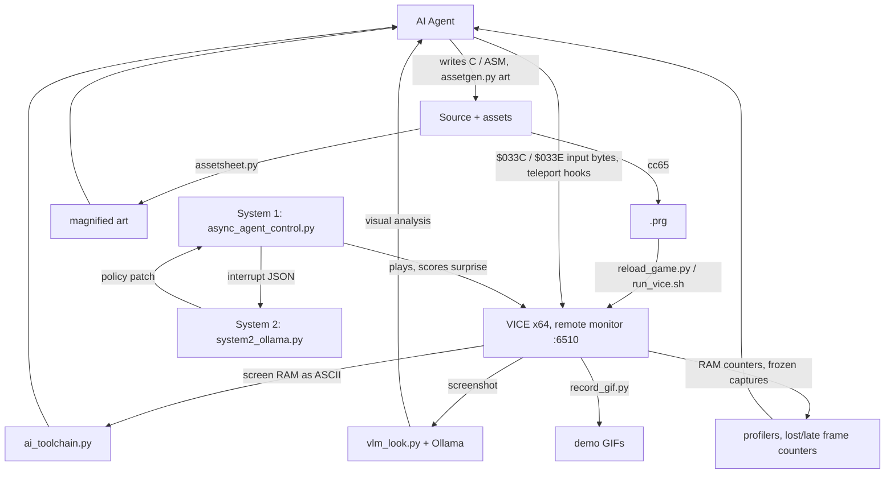
```mermaid
graph TD
    AI[AI Agent] -->|writes C / ASM, assetgen.py art| Code[Source + assets]
    Code -->|cc65| Binary[.prg]
    Binary -->|reload_game.py / run_vice.sh| VICE[VICE x64, remote monitor :6510]
    VICE -->|screen RAM as ASCII| Bridge[ai_toolchain.py]
    Bridge --> AI
    VICE -->|screenshot| VLM[vlm_look.py + Ollama]
    VLM -->|visual analysis| AI
    VICE -->|RAM counters, frozen captures| Probes[profilers, lost/late frame counters]
    Probes --> AI
    AI -->|"$033C / $033E input bytes, teleport hooks"| VICE
    Code -->|assetsheet.py| Sheet[magnified art]
    Sheet --> AI
    VICE -->|record_gif.py| GIF[demo GIFs]
    S1[System 1: async_agent_control.py] -->|plays, scores surprise| VICE
    S1 -->|interrupt JSON| S2[System 2: system2_ollama.py]
    S2 -->|policy patch| S1
```

Two loops, then. The **development loop** — edit, build, reload, look — is what every game here went through. The **play loop** is newer: a fast System 1 that watches the machine and drives the joystick byte, and a slow System 2 (an LLM) that is woken only when System 1 is surprised. The scrolling games add a third element that turned out to matter most: **the agent's own instruments** — cycle counters read through the monitor, frame-lost and frame-late counters, captures frozen with RAM read in the same session as the screenshot. Every hard problem in IRON VEIN was found by one of those, not by looking.

## The Stack

- **AI Models (tested)**:
  - **Google Gemini 3** — the classic clones (Space Invaders, Arkanoid, Pac-Man, Snake, Tetris v2)
  - **Claude Sonnet 4.5 / 4.6** — Tetris v1, Frogger
  - **Claude Opus 4.5 / 4.6** (GitHub Copilot in VS Code) — Pong, Breakout, then the original METEOR STORM with its autonomous debugging including memory-layout fixes
  - **OpenAI GPT-5.5** — Dreadline (mixed C and assembly, the asset pipeline, the System 1 test bed) and Sky Miner
  - **Claude Fable 5** (Claude Code) — ION RIFT, GHOST KEEP, Boulder Rush and its bot, the asset tools
  - **Claude Fable 5.1** (Claude Code) — IRON VEIN, the profiling and filming tools
- **Agent harness**: Claude Code (terminal or VS Code extension) for the 2026 summer work; GitHub Copilot agent mode and Cursor earlier
- **Compiler**: `cc65` (6502/6510 cross-compiler, C and assembly; `-Or` puts `register` pointers in zero page, which matters)
- **Emulator**: `VICE` (`x64`, tested with 3.7.1) in remote monitor mode on port 6510
- **VLM**: Ollama with a local vision model — `gemma4:12b-it-qat` at the time of writing (`qwen3-vl` and its cloud variant are retired; pass `-m` or set `OLLAMA_MODEL`). Its reading of C64 text is unreliable, so the agent cross-checks against screen RAM.
- **Bridge**: Python 3 scripts handling socket communication, screenshots, visual feedback, asset generation and filming

## Getting Started

### Prerequisites
- **cc65**: Cross-compiler suite.
- **VICE**: Commodore emulator (must support `-remotemonitor`).
- **Python 3** with Pillow (asset tools), `ffmpeg` (GIFs), Ollama (visual checks).

### Installation

```bash
# Clone the repo
git clone https://github.com/dexmac221/C64AIToolChain.git
cd C64AIToolChain

# Install dependencies (Linux)
sudo apt install cc65 vice python3 ffmpeg
pip install -r requirements.txt
```

### Quick Start — Play a Game

Every game directory includes a pre-compiled `.prg` file and a launcher:

```bash
cd ironvein
./run_vice.sh          # joystick in port 2; idle for a while and the autopilot plays
```

The launchers clear the environment variables that a snap-packaged VS Code leaks into its terminal (they make VICE crash at start with a glibc error), keep the sound server, and start windowed. If VICE dies on launch from an IDE terminal, copy the `env -u …` line from `ironvein/run_vice.sh`; see also [PROJECTINFO.md](PROJECTINFO.md).

### The AI Development Workflow

1.  **Launch the environment** — VICE with the remote monitor:
    ```bash
    cd snake
    ./run_vice.sh
    ```

2.  **Look** — in a separate terminal, the Python bridge shows the C64 screen as ASCII, so an agent can verify the game state without eyes; `vlm_look.py` adds the eyes:
    ```bash
    python3 ai_toolchain.py
    python3 vlm_look.py -m gemma4:12b-it-qat
    ```

3.  **Iterate** — modify the source, rebuild, hot-reload:
    ```bash
    ./build.sh && python3 reload_game.py
    ```
    The loader detects the literal BASIC `SYS` entrypoint and verifies the PRG bytes in RAM before starting. For a program without a supported BASIC stub, pass `--start HEX` explicitly.

4.  **Play it from outside** — the newer games OR a byte at `$033C` into the joystick (up 1, down 2, left 4, right 8, fire 16; the game clears it after reading, so it is edge-triggered) and hold bits at `$033E`. GHOST KEEP, ION RIFT and IRON VEIN add teleport hooks (`$0340`/`$0341`) so a bot or a film script can jump to a section. Through the monitor: `> 033c 10` is one press of fire.

The rules the agents are held to are in [AGENT_RULES.md](AGENT_RULES.md); the practical guide is [AGENT_HOWTO.md](AGENT_HOWTO.md); the original development notes are [AI_DEVELOPMENT.md](AI_DEVELOPMENT.md) and [AI_COMPARISON.md](AI_COMPARISON.md).

## Toolchain Components

### `run_vice.sh`
Launcher wrapper: `./run_vice.sh path/to/game.prg` from the repo root, or `./run_vice.sh` inside a game directory. The root script defers to `run_vice_generic.sh` (which clears the worst of the IDE environment and pins the emulator speed); the per-game scripts in the newer directories carry the fuller environment recipe.

### `ai_toolchain.py`
The eyes of the system, text edition. It connects to `localhost:6510`, dumps the screen RAM range `$0400-$07E7`, and renders it as ASCII. This lets an agent verify what is written on screen, exactly, which a vision model cannot always do.

### `vlm_look.py` and `look_screen.py`
The visual feedback loop. `vlm_look.py` takes a screenshot from VICE, sends it to a local Ollama vision model and returns a structured analysis of the game state (sprites, text, glitches); `look_screen.py` converts the screenshot to ASCII art for text-only models. Between them and the screen RAM dump, the agent "sees" the game screen. The human's eye still outranks all three.

### `reload_game.py`
The hands of the system. It loads and verifies the PRG in one monitor connection, then starts at its BASIC SYS entrypoint, preserving the emulator window. A failed load/verification resets the machine instead of executing unverified bytes. It does not restore arbitrary previous machine state.

### `async_agent_control.py`
The fast/slow gameplay testing loop. A local System 1 controller samples VICE hardware state at high frequency, watches sprite registers, collisions, sprite pointers, and screen RAM, then accumulates a Surprise/Frustration score. When the score crosses a threshold, it can either stop and write an interrupt JSON for deliberate inspection, or keep the gameplay thread running while archiving interrupt events and dispatching them to System 2 asynchronously.

```bash
# Observe Dreadline once
python3 async_agent_control.py --game dreadline --once

# Run until a slow-loop interrupt is generated
python3 async_agent_control.py --game dreadline --threshold 12

# Let System 1 drive Dreadline through its monitor-written agent input byte
./run_vice.sh dreadline/dreadline.prg
python3 async_agent_control.py --game dreadline --control vice-memory --start-fire-frames 20 --max-frames 300

# Keep the game running and send archived interrupt events to System 2 in the background
python3 async_agent_control.py --game dreadline --system1 neural --neural-model .agent_control/system1_dreadline.pt --control vice-memory --start-fire-frames 20 --interrupt-mode continue --interrupt-cooldown-frames 30 --system2-script system2_ollama.py --system2-model deepseek-v4-flash:cloud --max-frames 300

# Train and use a neural System 1 distilled from synthetic heuristic data
python3 neural_system1.py train --output .agent_control/system1_dreadline.pt
python3 async_agent_control.py --game dreadline --system1 neural --neural-model .agent_control/system1_dreadline.pt --control vice-memory --start-fire-frames 20 --max-frames 300

# Ask an Ollama cloud model to analyze the latest slow-loop interrupt
python3 system2_ollama.py --model deepseek-v4-flash:cloud --escalate-model deepseek-v4-pro:cloud
```

Safety note: `--once` leaves VICE paused by default, and the fast loop clamps overly aggressive sampling intervals unless `--unsafe-fast` is explicitly used. VICE 3.7.1's monitor also wedges under hundreds of short connections, so long runs are better served by the games' own demo modes.

Full architecture: [ASYNC_AGENT_CONTROL.md](ASYNC_AGENT_CONTROL.md) · Article: [articles/SYSTEM1_GAME_UNDERSTANDING.md](articles/SYSTEM1_GAME_UNDERSTANDING.md)

### `img2sprite.py`
Turns any picture into the 12×21 multicolour grid the games' `assetgen.py`
already eats. A sprite is 63 bytes with four states per cell — transparent,
`$D025`, `$D026`, and the sprite's own colour — so the script's whole job is
spending that budget: mask the subject, average it down, and fit every cell to
the nearest of the three inks (brute-forcing the palette when you let it
choose).

```bash
./img2sprite.py knight.png --name ART_STAND --preview /tmp/k.png
./img2sprite.py zombie.png --stretch --ink 5 --outline   # shape only
```

It is exact — round-tripping a hand-drawn sprite through a rendered PNG gives
back all 21 rows unchanged — but exactness is not the same as usefulness. What
survives 12×21 is a bold shape with real tonal structure; realistic figures,
spread wings and heraldry arrive as mush, whatever generated or drew them. See
[img2sprite_examples.png](articles/img2sprite_examples.png).

### `assetsheet.py`
The other direction, and the more useful one. Art authored as ASCII inside a
game's `assetgen.py` is only ever seen 21 pixels tall inside a screenshot —
which is to say, never seen. This draws every sprite and tile magnified, in the
colours the game actually sets, on the game's own background.

```bash
./assetsheet.py ghosts/assetgen.py --out /tmp/sheet.png
./assetsheet.py ghosts/assetgen.py --strip ART_RUN1,ART_RUN2 --scale 14
./assetsheet.py ironvein/assetgen.py --sprite-col HERO=14,DRONE=13 --only HERO
./assetsheet.py ghosts/assetgen.py --tiles --grid
```

It paid for itself the first time it was run: GHOST KEEP's knight and its
zombies turned out to be [the same silhouette in two
colours](articles/ghostkeep_sprite_redraw.png), which had been mistaken for a
scrolling problem. IRON VEIN's hero was drawn as a strip on it before it was
ever compiled.

### `record_gif.py`
Film a running VICE through its monitor and make a GIF. Every frame is the
emulator's own screenshot, so nothing on top of its window gets in; between
captures the game runs at full speed. Monitor commands can be scheduled, and
the games' agent hooks (teleports, held joystick bits) become the script:

```bash
./record_gif.py --out ironvein/ironvein_demo.gif --seconds 36 \
    --at "8:> 0341 02" --at "17:> 0341 03" --at "26:> 0341 04"
```

### `screenshot.sh`
Capture screenshots from VICE via the remote monitor. Supports multiple formats.

```bash
# Take a PNG screenshot (default)
./screenshot.sh myscreen

# Take a GIF screenshot
./screenshot.sh myscreen 3

# Formats: 0=BMP, 1=PCX, 2=PNG, 3=GIF, 4=IFF
```

## Articles

*   [IRON VEIN: an 8-way scroller on the C64, built by an agent that had to measure everything](articles/IRONVEIN_8WAY.md)
*   [System 1 for C64 Games: a fast reflex layer that teaches the agent what the game means](articles/SYSTEM1_GAME_UNDERSTANDING.md)
*   [Fable benchmark: ION RIFT and the scrolling engine](articles/FABLE_BENCHMARK.md)
*   [Dreadline](articles/DREADLINE.md) · [METEOR STORM: full creative process log](articles/METEOR_STORM.md)
*   [The Commodore 64 Constraint: Why Gemini 3 is the First AI to Beat the Tetris Test](https://medium.com/@gianlucabailo/the-commodore-64-constraint-why-gemini-3-is-the-first-ai-to-beat-the-tetris-test-6db84609ae15)
*   [I Made Claude and Gemini Write Tetris for a 1982 Computer](https://medium.com/@gianlucabailo/i-made-claude-and-gemini-write-tetris-for-a-1982-computer-cc5c85936f8d)
*   [Claude 4.6 and the Commodore 64: When an LLM Writes, Builds, and Playtests Its Own Game](https://medium.com/ai-advances/claude-4-6-and-the-commodore-64-when-an-llm-writes-builds-and-playtests-its-own-game-bdeb9dca3c74)

## License
MIT
