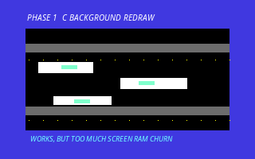
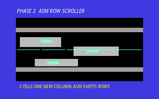
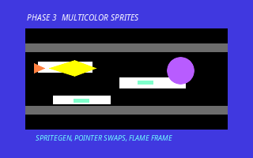
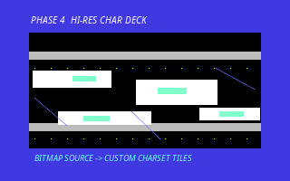

# Building Dreadline: When an AI Agent Learns to Think Like the VIC-II

*A Commodore 64 side-scrolling attack game evolved through C, 6502 assembly, generated sprites, bitmap-derived tiles, and emulator feedback.*

---

## Author's Preface

**By the human in the loop**

This project started as a question: could an AI coding agent use a C64 development toolchain not just to write code, but to iterate like a retro game programmer?

The workspace already contained a growing set of Commodore 64 experiments built with cc65, VICE, Python monitor tools, screenshots, and an AI-assisted verification loop. Earlier work had produced arcade-style games, sprite demos, and a more complete original game called Meteor Storm. The next step was more ambitious: an original game in the spirit of fast low-altitude dreadnought attack games, but not a direct clone.

The challenge became **Dreadline**: a small but increasingly technical C64 game where a starfighter races across the deck of a hostile vessel, dodging drones and turrets, firing at targets, and surviving as the speed increases.

What made the session interesting was not just the final game. It was the path: every time the game improved visually, a new hardware constraint appeared. Full background redraws were too slow. Sprites needed color and animation. Bitmap art looked better in theory, but raw bitmap scrolling was too expensive. The solution was a very C64 kind of compromise: use bitmap art as a source, generate a custom character set, scroll character rows in assembly, and keep the gameplay sprites on top.

This article documents that loop.

---

## The Starting Point

The initial request was open-ended:

> *"What about to create a Commodore 64 original game clone like Uridium?"*

The goal was not to reproduce a commercial game. The goal was to capture a broad feeling: a ship flying over a huge mechanical deck, side-scrolling at speed, with enemies and targets layered on top.

The first version of Dreadline was written in C using cc65. It used:

- Hardware sprites for the player ship, beam, drones, turrets, and cores
- Screen RAM for the deck and HUD
- Color RAM for deck accents
- Demo mode so the game could play itself for visual inspection
- VICE screenshots and monitor reads to verify output

The first version worked, but it had a classic C64 problem: it was doing too much in C.

---

## Phase 1: The Slow Background Problem

The first deck renderer redrew the whole playfield repeatedly. On a modern machine this would be trivial. On a C64, through cc65-generated 6502 code, a full 40-column by 21-row background update was too expensive.

The symptom was visible slowness. The sprites were hardware accelerated, but the background refresh ate the frame budget.

The first optimization was architectural: draw the deck once, then scroll it by copying each row one character left and generating only the new rightmost column.

That changed the work per scroll from roughly:

```text
40 columns * 21 rows = 840 cells
```

to:

```text
39 copied cells * 19 rows + 19 new cells = 760 memory copies plus tiny generation
```

Still a lot, but much better because most of the work became predictable memory copying.

Then came the real C64 step: move the row-copy hot path to assembly.

---

## Phase 2: Assembly Row Scrolling

The file `fastscroll.s` was added as a small ca65 module exporting one C-callable routine:

```asm
.export _scroll_deck_rows
```

The C code calls it as:

```c
extern void scroll_deck_rows(void);
```

The routine shifts rows 4 through 22 one character left in screen RAM and color RAM. C then fills the new rightmost column.

The first assembler attempt used a repeated macro-local label. ca65 rejected it because the label was not unique across macro expansions. The fix was simple and revealing: pass an explicit unique loop label for each row.

The result was a mixed C/assembly renderer:

- C controls game logic, spawning, collision, HUD, and right-column generation
- Assembly performs the repetitive row-copy work
- VICE verifies that the deck still scrolls and sprites remain active

This was the first major turning point. The game felt more like a C64 program instead of a C program merely targeting the C64.

---

## Phase 3: Multicolor Sprites and Generated Art

The next improvement was visual. The original sprites were single-color byte tables written by hand. They worked, but they looked plain.

The solution was a small generator: `spritegen.py`.

Instead of editing raw 63-byte sprite arrays directly, the generator lets the developer draw C64 multicolor sprites as 12 by 21 ASCII art:

```text
space = 00 transparent
.     = 01 shared multicolor 0 ($D025)
#     = 10 sprite individual color ($D027-$D02E)
+     = 11 shared multicolor 1 ($D026)
```

The generator packs those logical pixels into real C64 multicolor sprite bytes and emits `sprites_mc.h`.

This changed the sprite workflow completely. The player ship, drone, turret, and core gained two animation frames each. Animation stayed cheap because the runtime does not rewrite sprite data every frame. It only swaps sprite pointers in `$07F8-$07FF`.

The ship also evolved visually during the session:

1. A simple forward craft
2. A right-facing side-profile craft, rotated to match the direction of travel
3. A two-frame animated ship with a visible rear flame plume

This was a good example of AI-assisted asset iteration. The agent could edit the source art, regenerate byte arrays, rebuild, launch VICE, take a screenshot, inspect the result, and refine.

---

## Phase 4: Bitmap Source, Wrong Output

The human then pointed out an important visual issue:

> *"The original ships were on a sort of starship deck. It was a bitmap. Can you try to use a bitmap instead of ASCII?"*

The first response was halfway right and halfway wrong.

The agent created `deck_bitmap.pgm`, a real bitmap source image, and wrote `bggen.py` to convert it into screen and color tables. But the conversion reduced 4 by 4 pixel blocks into punctuation-like screen characters: `.`, `:`, `/`, `\`, `+`, and block characters.

Technically, the source was a bitmap. Visually, the output still looked too much like ASCII.

The human correctly called this out:

> *"Bitmap is not really bitmap but ASCII. Probably you need to create hi-res C64 with more characters."*

That was the key design correction.

---

## Phase 5: Custom Hi-Res Character Deck

A full raw C64 bitmap would have been expensive to scroll. A 320 by 200 bitmap is 8KB of bitmap data plus color data, and horizontal scrolling it by software every frame would be a poor fit for this game.

The better C64 solution was a custom character deck:

1. Keep the source as a high-resolution pixel bitmap.
2. Split it into 8 by 8 tiles.
3. Deduplicate those tiles into a custom charset.
4. Store tile IDs in screen RAM.
5. Store per-tile colors in color RAM.
6. Continue using the assembly character-row scroller.

This gives a bitmap-authored look while preserving character-mode performance.

`bggen.py` was rewritten to generate:

- `dreadline_charset[2048]`
- `dreadline_bg_screen[DREADLINE_BG_ROWS][DREADLINE_BG_WIDTH]`
- `dreadline_bg_color[DREADLINE_BG_ROWS][DREADLINE_BG_WIDTH]`

The generator reported:

```text
77 custom deck chars
```

That fits comfortably inside a 256-character C64 charset while leaving room for HUD text and border tiles.

---

## Phase 6: VIC Bank Memory Layout

The generated custom charset introduced a memory layout problem. The original game used the default C64 screen at `$0400` and sprite data around `$3000` or `$3800`. As the program grew, those addresses became risky.

The solution was to move the video display into VIC bank 1:

```text
$4000-$7FFF  VIC bank 1
$4400-$47FF  Screen RAM
$47F8-$47FF  Sprite pointers
$6000-$67FF  Custom charset
$7800-$7A3F  Sprite data
$D800-$DBFF  Color RAM
```

The runtime now initializes video memory by:

```c
VIC_BANK = (VIC_BANK & 0xFC) | 0x02;
VIC_MEM = 0x18;
```

Then it copies the generated charset to `$6000` and draws into screen RAM at `$4400`.

The assembly scroller also had to change. Its row bases moved from `$04A0-$0770` to `$44A0-$4770`. This is the kind of low-level detail that makes C64 development such a good test for tool-using AI agents: the C code, assembly code, generator output, and VIC-II registers all have to agree.

---

## The Final Architecture

Dreadline now uses a hybrid rendering architecture:

### Static and Scrolling Background

- Source art: `deck_bitmap.pgm`
- Generator: `bggen.py`
- Output: custom charset plus screen/color tables
- Runtime: screen RAM scrolls left through `fastscroll.s`
- C fills the new rightmost column from generated tables

### Sprite Layer

- Source art: 12 by 21 ASCII sprite drawings in `spritegen.py`
- Output: packed C64 multicolor sprite frames in `sprites_mc.h`
- Runtime: sprite data copied once to `$7800`
- Animation: pointer swaps only, no per-frame sprite byte copying

### Game Logic

- Player movement through joystick port 2
- Demo AI for autonomous viewing
- Beam firing and collision checks
- Drones, turrets, and cores as hardware sprites
- Score, shields, speed, and game-over loop

The result is not a raw bitmap scroller. It is something more appropriate for this machine: a bitmap-authored, hi-res-character C64 deck renderer.

---

## Verification Loop

Every major change was verified with the same project philosophy:

1. Build with cc65 through `./build.sh dreadline`
2. Launch VICE with remote monitor enabled
3. Capture screenshots with `screenshot.sh`
4. Inspect screen state where useful
5. Fix what the emulator, compiler, or screenshot revealed

Several concrete issues were found this way:

- ca65 macro labels had to be made unique
- sprite RAM had to move when the binary grew
- VICE launch flags had to be exact for monitor access
- the first bitmap pipeline looked too ASCII-like
- the final display needed a new VIC bank and matching assembly addresses

The important lesson is that the AI did not simply write a large patch and hope. It repeatedly built, ran, observed, and adjusted.

---

## Development Step Gallery

The original intermediate VICE screenshots were temporary working files and were not retained. The images below are reconstructed phase captures made after the fact to document the visual direction of each step. The final image is the real emulator screenshot committed with the project.

### Phase 1: C Background Redraw

<p align="center">
  
</p>

The earliest renderer proved the side-scrolling deck concept, but the full-screen redraw approach made the game visibly slow.

### Phase 2: Assembly Row Scroller

<p align="center">
  
</p>

The background became a row-copy problem: assembly shifted existing screen and color RAM while C generated only the new rightmost column.

### Phase 3: Multicolor Sprites

<p align="center">
  
</p>

The sprite pipeline replaced plain single-color shapes with generated multicolor frames, animated by sprite pointer swaps.

### Phase 4: Hi-Res Character Deck

<p align="center">
  
</p>

The bitmap source became a custom hi-res character set, preserving a mechanical deck look while keeping character-mode scrolling performance.

### Final Emulator Capture

<p align="center">
  
</p>

The final capture shows the committed game running in VICE with the generated deck, animated sprites, demo mode, and the right-facing ship flame.

---

## Technical Summary

| Area | Final Choice |
|------|--------------|
| Language | C with cc65, plus ca65 assembly |
| Target | Commodore 64 |
| Main game file | `dreadline.c` |
| Assembly hot path | `fastscroll.s` |
| Sprite generator | `spritegen.py` |
| Background generator | `bggen.py` |
| Background source | `deck_bitmap.pgm` |
| Generated background | `background_mc.h` |
| Generated sprites | `sprites_mc.h` |
| Screen RAM | `$4400` |
| Sprite pointers | `$47F8-$47FF` |
| Custom charset | `$6000` |
| Sprite data | `$7800` |
| Background style | Bitmap-authored hi-res custom character deck |
| Sprite style | Multicolor hardware sprites |
| Animation method | Sprite pointer swapping |
| Latest binary size | 12,792 bytes |
| Custom deck chars | 77 |

---

## What This Demonstrates

The interesting part of Dreadline is not that an AI generated a game file. The interesting part is the feedback between constraints and design.

When the background was slow, the solution was not to optimize random C expressions. It was to change the rendering model and move the hot loop to assembly.

When sprites looked weak, the solution was not to hand-type more hex bytes. It was to create an asset pipeline that could generate valid C64 sprite data from editable source art.

When the bitmap deck looked too much like ASCII, the solution was not to insist that the first answer was good enough. It was to adopt a better C64-native representation: custom hi-res character tiles.

When memory addresses no longer fit, the solution was not guesswork. It required changing VIC bank selection, screen pointers, sprite pointer addresses, charset placement, and assembly row bases together.

That is the real experiment: can an AI agent stay oriented across gameplay code, generated assets, assembly routines, emulator behavior, and hardware memory maps? In this case, yes. With human direction at the right moments, the agent pushed the program toward a more authentic C64 architecture.

---

## Conclusion

Dreadline began as a simple side-scrolling C64 attack game. It became a compact case study in retro systems development:

- C for gameplay
- Assembly for scrolling speed
- Hardware sprites for moving objects
- Generated multicolor frames for animation
- A bitmap-authored custom charset for the deck
- VICE screenshots for visual verification

The final result is still small, still imperfect, and still very much a work in progress. But it has crossed an important threshold. It no longer feels like a plain C program printing characters. It feels like a C64 program using C64 tricks: VIC bank layout, custom character graphics, color RAM, sprite pointers, and careful memory placement.

That is where the fun starts.

---

**Tags:** `#AI` `#RetroComputing` `#Commodore64` `#GameDev` `#LLM` `#cc65` `#6502` `#VICII`