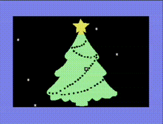

# Christmas Demo



A festive Commodore 64 demo featuring:
- **High-Quality Image Rendering**: Uses an improved Python converter with LAB color space matching and Floyd-Steinberg dithering to display images using standard C64 characters.
- **SID Music**: Plays a simplified "Jingle Bells" melody using the SID chip (Pulse wave).
- **Snow Animation**: Procedural snow effect falling over the image.

## How it Works

1. **Image Conversion**: 
   The `image_improved.py` script converts a PNG image into C64 character data (`charmap.h`), screen map (`img.h`), and color data (`clrs.h`). It uses advanced dithering to simulate more colors than the C64's fixed 16-color palette allows.

2. **Display Engine**:
   The C program (`main.c`) loads these headers and writes them to Screen RAM ($0400) and Color RAM ($D800).

3. **Snow Effect**:
   A custom "snow" character (asterisk/star shape) is animated by saving/restoring the underlying image data as the snow flakes move down the screen.

## Usage

### Build and Run
```bash
make
./run_vice.sh
```

### Change the Image
You can use your own image (PNG format recommended):

```bash
# Convert new image (with preview)
python3 image_improved.py my_image.png --preview

# Rebuild
make clean && make
./run_vice.sh
```

### Image Converter Options
The converter supports various options to tune the output:

```bash
python3 image_improved.py image.png --threshold 100   # Adjust brightness threshold
python3 image_improved.py image.png --invert          # Invert pattern
python3 image_improved.py image.png --no-dither       # Disable dithering
```
