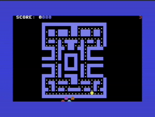

# Pac-Man for Commodore 64 - Assembly Version

**⚠️ EXPERIMENTAL / CASE STUDY**

This is a Pac-Man clone written in raw 6502 assembly. While functional, it serves primarily as a **case study in the difficulty of AI-generated Assembly code**.

For a more robust and maintainable version, please see the **C Version** in `../pacman_c/`.

## Status & Known Issues

-   **Complexity**: The codebase is significantly harder to maintain than the C version.
-   **Bugs**: Prone to "logic drift" and variable clobbering (e.g., ghost movement logic).
-   **Recommendation**: Use this for benchmarking AI assembly capabilities, but prefer the C version for actual game development.

## Features

- Classic Pac-Man gameplay with maze navigation
- 5 hardware sprites (Pac-Man + 4 ghosts)
- Dot eating with scoring
- Power pellets
- SID sound effects
