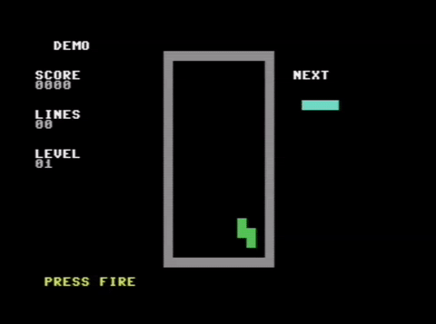

# Tetris for Commodore 64

A complete Tetris implementation written in 6502 assembly language for the Commodore 64, created using the C64 AI ToolChain.



## Overview

This Tetris game was developed iteratively using AI assistance and the C64 AI ToolChain, which provides real-time screen monitoring and hot-reload capabilities. The development process demonstrates how modern AI tools can help create retro games for classic 8-bit hardware.

## Features

- **All 7 Standard Tetrominoes**: I, O, T, S, Z, J, L pieces with authentic colors
- **4 Rotation States**: Each piece can rotate through 4 orientations
- **Line Clearing**: Complete lines are detected and cleared with scoring
- **Level Progression**: Speed increases as you clear more lines
- **Demo Mode**: AI plays automatically until you press fire to start
- **Smooth Gameplay**: VBlank-synchronized rendering for flicker-free display

## Development Journey

### Step 1: Project Setup

Created the basic project structure following the C64 AI ToolChain pattern:

```
tetris/
├── build.sh      # Build script using cl65
├── run_vice.sh   # VICE emulator launcher
├── tetris.cfg    # Linker configuration
├── tetris.s      # Main assembly source
└── tetris.prg    # Compiled program
```

### Step 2: Core Game Engine

Implemented the fundamental Tetris mechanics:

1. **Board Representation**: 10x20 playfield stored in a byte array
2. **Piece Data**: Each tetromino defined as 4 X/Y offset pairs for each rotation
3. **Collision Detection**: Check if piece can move/rotate without hitting walls or locked pieces
4. **Piece Locking**: When a piece can't move down, it locks into the board
5. **Line Clearing**: Scan for complete rows, shift everything down

### Step 3: Debugging Pointer Corruption

**Problem**: Random blocks appeared on screen, pieces displayed incorrectly.

**Root Cause**: The `calc_screen_pos` subroutine was overwriting zero-page variables (`ptr_lo`/`ptr_hi`) that were also used by the piece drawing routine.

**Solution**: Created dedicated `piece_ptr_lo`/`piece_ptr_hi` variables for piece rendering, separate from the screen position calculation.

```asm
; Dedicated piece pointer (not corrupted by calc_screen_pos)
piece_ptr_lo:   .byte 0
piece_ptr_hi:   .byte 0
```

### Step 4: Fixing Flickering

**Problem**: Pieces flickered during movement.

**Root Cause**: Drawing the new position before erasing the old position caused visual artifacts.

**Solution**: Implemented a clear-then-draw pattern with VBlank synchronization:

```asm
; 1. Clear old position
jsr clear_piece
; 2. Update position
; 3. Wait for VBlank
jsr wait_vblank
; 4. Draw new position
jsr draw_piece
```

### Step 5: Line Clearing Bug

**Problem**: Complete lines weren't being detected or cleared properly.

**Root Cause**: The X register was being corrupted by `get_board_cell` and `set_board_cell` subroutines while being used as a loop counter.

**Solution**: Used a dedicated zero-page variable `loop_i` instead of the X register for loop counting:

```asm
; Before (buggy):
ldx #0
check_loop:
    jsr get_board_cell  ; Destroys X!
    inx
    cpx #BOARD_WIDTH
    bne check_loop

; After (fixed):
lda #0
sta loop_i
check_loop:
    jsr get_board_cell
    inc loop_i
    lda loop_i
    cmp #BOARD_WIDTH
    bne check_loop
```

### Step 6: Board Cell Access Bugs

**Problem**: Pieces accumulated with gaps, board state was inconsistent.

**Root Cause**: Missing `CLC` before `ADC` instructions in board index calculation caused incorrect cell addressing when the carry flag was set.

**Solution**: Always clear carry before addition:

```asm
get_board_cell:
    ; Calculate index: y * BOARD_WIDTH + x
    lda test_y
    asl             ; *2
    asl             ; *4
    asl             ; *8
    clc             ; CRITICAL: Clear carry!
    adc test_y      ; *9
    clc             ; Clear carry again!
    adc test_y      ; *10
    clc             ; And again before adding X!
    adc test_x
    tax
    lda game_board, x
    rts
```

### Step 7: Adding Demo Mode

Implemented an AI demo mode that plays automatically:

1. **Demo Flag**: `demo_mode` variable toggles between AI and human control
2. **AI Target Calculation**: When piece spawns, AI calculates best column
3. **Movement Logic**: AI moves piece toward target, occasionally rotates
4. **"PRESS FIRE" Prompt**: Displayed during demo, game starts on fire button

### Step 8: AI Improvement

**Problem**: Initial AI played randomly, piling pieces chaotically.

**Solution**: Implemented board analysis to find optimal placement:

```asm
ai_find_lowest_column:
    ; Scan each column from left to right
    ; Find the column with the shortest stack
    ; This levels the playfield and creates line-clearing opportunities
```

The AI now:
- Analyzes the current board state
- Finds the column with the most empty space
- Moves pieces to level the playfield
- Creates opportunities for line clears

## Technical Details

### Memory Map

| Address | Purpose |
|---------|---------|
| $0002-$00FF | Zero Page Variables |
| $0400-$07E7 | Screen RAM |
| $D800-$DBE7 | Color RAM |
| $0801 | Program Start |

### Key Zero Page Variables

```asm
ptr_lo      = $02    ; General pointer (low byte)
ptr_hi      = $03    ; General pointer (high byte)
cur_x       = $10    ; Current piece X position
cur_y       = $11    ; Current piece Y position
cur_piece   = $12    ; Current piece type (0-6)
cur_rot     = $13    ; Current rotation (0-3)
game_over   = $14    ; Game over flag
score_lo    = $15    ; Score (low byte)
score_hi    = $16    ; Score (high byte)
```

### Tetromino Data Format

Each piece is defined as 4 rotations, each rotation as 4 (X,Y) offset pairs:

```asm
; I-piece (index 0)
piece_i:
    ; Rotation 0: horizontal ####
    .byte 0, 0,  1, 0,  2, 0,  3, 0
    ; Rotation 1: vertical
    .byte 0, 0,  0, 1,  0, 2,  0, 3
    ; ... etc
```

### Color Scheme

| Piece | Color | C64 Color Code |
|-------|-------|----------------|
| I | Cyan | 3 |
| O | Yellow | 7 |
| T | Purple | 4 |
| S | Green | 5 |
| Z | Red | 2 |
| J | Blue | 6 |
| L | Orange | 8 |

## Building

### Prerequisites

- [cc65](https://cc65.github.io/) - 6502 C compiler and assembler suite
- [VICE](https://vice-emu.sourceforge.io/) - Commodore 64 emulator

### Compile

```bash
./build.sh
```

This runs:
```bash
cl65 -t c64 -C tetris.cfg -o tetris.prg tetris.s
```

### Run

```bash
./run_vice.sh
```

Or manually:
```bash
x64 -remotemonitor -autostart tetris.prg
```

## Controls

| Key/Button | Action |
|------------|--------|
| A / ← | Move Left |
| D / → | Move Right |
| W / ↑ | Rotate |
| S / ↓ | Soft Drop |
| Fire (Joystick) | Start Game / Rotate |

## Development Tools Used

### C64 AI ToolChain

The [C64 AI ToolChain](../README.md) was essential for rapid development:

1. **Screen Monitoring** (`ai_toolchain.py`): Real-time ASCII visualization of the C64 screen via VICE's remote monitor
2. **Hot Reload** (`reload_game.py`): Instant program reload without restarting the emulator
3. **Remote Debugging**: Connect to VICE's monitor on port 6510 for memory inspection

### Workflow

```
┌─────────────────┐     ┌─────────────────┐     ┌─────────────────┐
│   Edit Code     │────▶│   Build (cl65)  │────▶│  Hot Reload     │
│   (tetris.s)    │     │                 │     │  (reload_game)  │
└─────────────────┘     └─────────────────┘     └────────┬────────┘
                                                         │
┌─────────────────┐     ┌─────────────────┐              │
│   AI Analysis   │◀────│  Screen Monitor │◀─────────────┘
│   & Feedback    │     │  (ai_toolchain) │
└─────────────────┘     └─────────────────┘
```

## Lessons Learned

1. **Zero Page is Precious**: On 6502, zero page provides faster access but is limited. Plan variable allocation carefully.

2. **Register Preservation**: Always document which registers a subroutine modifies. The X and Y registers are often needed as loop counters.

3. **Carry Flag Matters**: The 6502's ADC instruction adds the carry flag. Always use CLC before multi-byte or repeated additions.

4. **VBlank Synchronization**: Update the screen during vertical blank to avoid visual tearing and flickering.

5. **Iterative Development**: The AI toolchain enabled rapid iteration - make a change, hot-reload, observe, repeat.

## Future Improvements

- [ ] Add sound effects using SID chip
- [ ] Implement high score saving
- [ ] Add two-player mode
- [ ] Wall kick rotation system
- [ ] Hold piece feature
- [ ] Ghost piece preview

## License

This project is part of the C64 AI ToolChain and is released under the MIT License.

## Acknowledgments

- Created with assistance from GitHub Copilot (Claude Opus 4.5)
- Built using the cc65 toolchain
- Tested on VICE emulator
- Inspired by the original Tetris by Alexey Pajitnov
